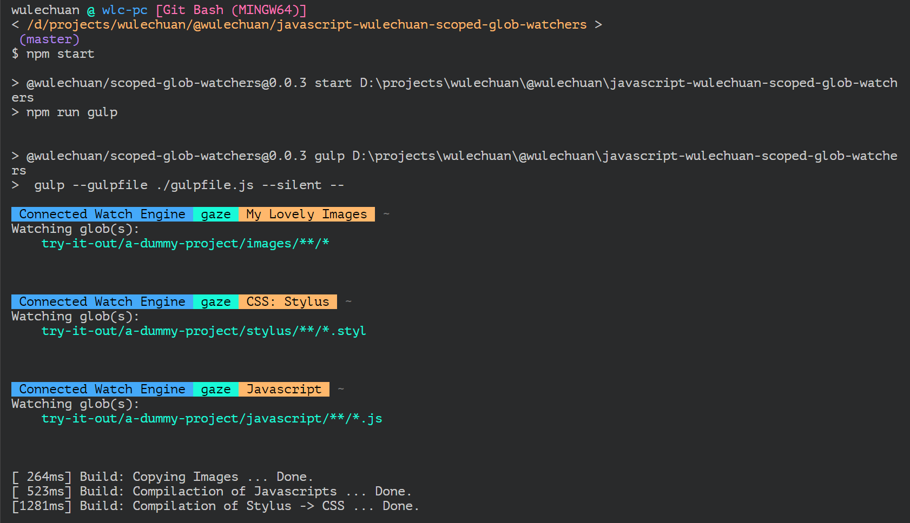
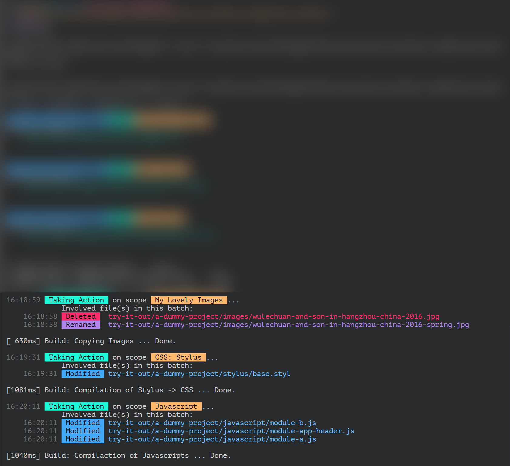

# Introduction

This is a lazy watchers controller for globs/files.

A watcher is called a **lazy** one is because when a file changing event issues,
the watcher doesn't take actions bound to that file change immediately,
but rather waits for a short period of time (*by default 900 milli seconds*)
to gather more changes of files,
be those changes happen to be of the same file, or not.
When the time is up for the said wait, the watcher act as desired.

This meshanism is meaningful in lots of cases
where a batch of files change almost at the same time,
while they all are bound to the same action,
and they are meant to share the single take of the action.

Say we are saving a bunch of files via a shortcut key in a powerful code editor,
like using the "<kbd>Ctrl+k s</kbd>" in [Microsoft Visual Studio Code](https://code.visualstudio.com/).
When several `.styl` files might change at the same time,
but a single compilation action is expected to be taken upon all these changes.

Currently the controller, or the mechanism, whatever, utilizes only the [gaze](https://github.com/shama/gaze) as the underlying file watching engine.
Though theoretically the controller could connect to any other watching engine,
as long as a connector is provided.

<br/>
<br/>
<br/>
<br/>

# Usage

## Example Codes

See the `gulpfile.js` included by this repository as an example.

Below are the key snippets from the said `gulpfile.js`.

```javascript
const scopedGlobsLazilyWatchingMechanism = require('.');

const scopedWatchingSettings = {
	'My Lovely Images': {
		globsToWatch:                      sourceGlobsOfImagesToWatch,
		actionToTake:                      taskBodyOfCopyingImages,
		shouldTakeActionOnWatcherCreation: true,
	},
	'CSS: Stylus': {
		globsToWatch:                      sourceGlobsOfStylusToWatch,
		actionToTake:                      taskBodyOfCompilingStylus,
		shouldTakeActionOnWatcherCreation: true,
	},
	'Javascript': {
		globsToWatch:                      sourceGlobsOfJavascriptToWatch,
		actionToTake:                      taskBodyOfCompilingJavascripts,
		shouldTakeActionOnWatcherCreation: true,
	},
};


gulp.task('build and then watch: everything', (thisTaskIsDone) => {
	scopedGlobsLazilyWatchingMechanism.createWatchersAccordingTo(scopedWatchingSettings, {
		basePath: npmProjectRootPath,
		// shouldLogVerbosely: false,
	});

	thisTaskIsDone();
});
```

<br/>
<br/>

## Try it out

There is a dummy project includes in this repository,
so that people can try this watchers controller without difficulty.

The said dummy project locates at `<this repository root folder>/try-it-out/a-dummy-project`.

A npm script entry of this repository has been setup
to run an instance of this watchers controller,
utilizing [gulp](https://gulpjs.com/).


To start, simply open a console/terminal and run:
```sh
npm start
```

When the script is running,
the watchers each watches a scoped globs within the dummy project.
Then you can randomly make some changes to the files inside the dummy project.
You can modify contents of some files, create new files, or delete existing ones.
Keep an eye on the console/terminal, you should see beatiful messages logged there.

> Note that it's the dummy project files that are watched, **not** the source files of this repository.

See some snapshots of mine:

At the moment the script just start:


After some changes are made:


<br/>
<br/>
<br/>
<br/>

# API

Sorry. I don't have too much spare time at present. I have my boy to take care of.

Cosume my *ugly* source codes if you'd like to. :p
