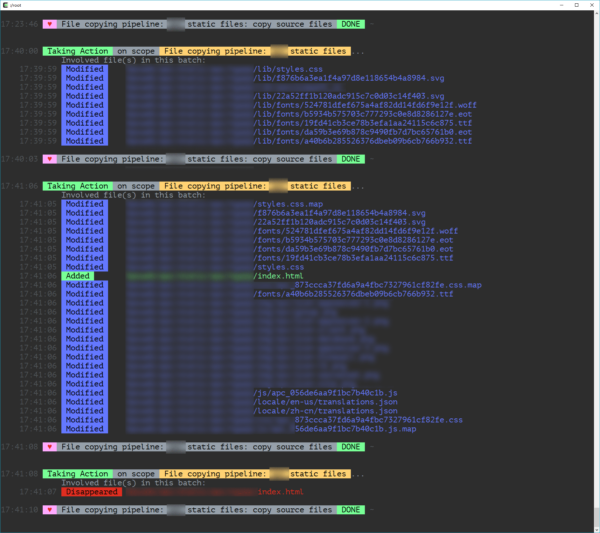

<link rel="stylesheet" href="./node_modules/@wulechuan/css-stylus-markdown-themes/dist/default.css">


# NPM Page

<dt>Package Name</dt>
<dd>

[@wulechuan/scoped-glob-watchers](https://www.npmjs.com/package/@wulechuan/scoped-glob-watchers)

</dd>
<dt>Author</dt>
<dd><p>南昌吴乐川</p></dd>
</dl>


# Introduction

This is a controller for multiple scoped lazy watchers upon globs/files.


## Scopes and Actions

A scope here means one or several globs.
A given watcher watches every file the said globs cover.
Whenever some change happened to any of those files,
a pre-defined action will be taken to response that change.
The response, aka the action, makes the watcher meaningful.
Otherwise, why do we watch a file?

**_In words, a scope is mapped to an action by a watcher._**

> The term `glob` basically means a description
> on how we can select some files we are interested in.
>
> See: https://www.npmjs.com/package/glob#glob-primer

It's worth to mention that a certain file is allowed and often needed to
be covered in several scopes. So that when the said file changes,
several actions will be taken at the same time.

**_In words, one change might cause multiple actions._**


## Lazy Meshanism

A watcher is called a **lazy** one is because when a file changing event issues,
the watcher doesn't take actions bound to that change immediately,
but rather waits for a short period of time (*by default `900` milliseconds*)
to gather more changes of files,
be those changes happen to be of the same file, or not.
When the time is up for the said wait, the watcher acts as desired.

This meshanism is meaningful in lots of cases
where a batch of files change almost at the same time,
while they all are bound to the same action,
and they are meant to share the single take of the action.

Say we are saving a bunch of files in one go
via a shortcut key in a powerful code editor,
like using the "<kbd>Ctrl</kbd>+<kbd>k</kbd> <kbd>s</kbd>" in
Microsoft [Visual Studio Code](https://code.visualstudio.com/).
When several `.styl` files might change at the same time,
only one single compilation action is expected to be taken upon all these changes.


## Multiple Watchers and One Controller over Them

Obviously we often need several watchers to watch different scopes.
For conveniences, I build this watchers controller,
which basically can create and handle multiple watchers in one go,
each watcher bound to a certain scope, aka some files on your file system.

## Underlying File Watching Engines

Currently the controller, or the mechanism, whatever,
utilizes only the [gaze](https://github.com/shama/gaze)
as the underlying file watching engine.
Though theoretically the controller could connect to any other watching engine,
as long as a connector is provided (which is not).


# Usage

An npm script entry of this repository has been setup
to run an instance of this watchers controller,
utilizing [gulp](https://gulpjs.com/).
So people can try it out right here inside this repository
before they decide to use it elsewhere.

See below [Try It out, See It in Action](#try-it-out-see-it-in-action).


## Example Codes

See the `gulpfile.js` included by this repository as an example.

Below is the key snippet from the said `gulpfile.js`.

```javascript
const npmProjectRootPath = prosess.cwd();

const scopedGlobsLazilyWatchingMechanism = require('.');

// Three scopes are defined below.
// And three watchers will be created for them each.
const scopedWatchingSettings = {
	'My Lovely Images': {
		globsToWatch:                      sourceGlobsOfImagesToWatch,
		actionToTake:                      taskBodyOfCopyingImages,
		shouldTakeActionOnWatcherCreation: true,
	},
	'CSS: Stylus': {
		globsToWatch:                      sourceGlobsOfStylusToWatch,
		actionToTake:                      taskBodyOfCompilingStylus,
		shouldTakeActionOnWatcherCreation: true,
	},
	'Javascript': {
		globsToWatch:                      sourceGlobsOfJavascriptToWatch,
		actionToTake:                      taskBodyOfCompilingJavascripts,
		shouldTakeActionOnWatcherCreation: true,
	},
};


gulp.task('build and then watch: everything', (thisTaskIsDone) => {
	scopedGlobsLazilyWatchingMechanism.createWatchersAccordingTo(
		scopedWatchingSettings,


		// Below is an object containing some shared options across all scopes.
		// Note that all properties of this object can be optionally set
		// individually for each and every scope,
		// overriding values defined here.
		{
			// Optional but important. Default to `process.cwd()`
			watchingBasePath:                npmProjectRootPath,

			// Optional. Just for better logging.
			basePathForShorteningPathsInLog: joinPath(
				npmProjectRootPath,
				'try-it-out/a-dummy-project'
			),

			// shouldLogVerbosely: false,
		}
	);

	thisTaskIsDone();
});
```


## Try It out, See It in Action

There is a dummy project included within this repository,
so that people can try this watchers controller without difficulty.

The said dummy project locates here:
```sh
<this repository root folder>/try-it-out/a-dummy-project
```


#### Before You Try

Before you can start trying,
you first need to install all dependencies for this npm project.

> This is a one time action, you don't need to do it
> every time before you run the tryout script.

Open a console/terminal and run:
```sh
npm install
```
or even simpler:
```sh
npm i
```

#### Run the Tryout Script

Open a console/terminal and run:
```sh
npm start
```
That's it.

#### What to Try?

Now the script is up and running,
what should we do to see something meaningful?

Well, the controller first create 3 watchers,
each for a scope covering some files in the dummy project.

Then you can randomly make changes to those files.
For example you can modify contents of some files and save them,
you can create some new files,
or you can delete existing ones.

Keep an eye on the console/terminal,
you should see beautiful messages logged there.

> Note that the scopes are designed in together
> to cover **all** files in that project.
> So basically **any** file change
> will for sure trigger some action.

> Also note that it's the *dummy project* files
> that are watched,
> **not** the source files of this repository.


### A Snapshot of Mine

Here is a snapshot of my console,
hosted within Cygwin.



# API

Sorry. I don't have too much spare time at present.
I have my boy to take care of.

Consult my *ugly* source codes if you'd like to. :p


# Changes from Version to Version

## Changes in v0.2.0

Only some internal APIs changed. Bugs Fixed.

## Changes in v0.1.0

1.  For the **construction options** of watchers,
	the property `basePath` has been renamed into `watchingBasePath`.


1.  For the **construction options** of watchers,
	a new property `basePathForShorteningPathsInLog` is added.
